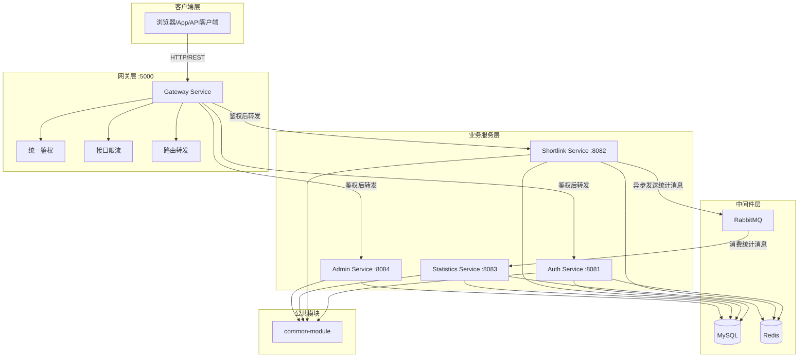
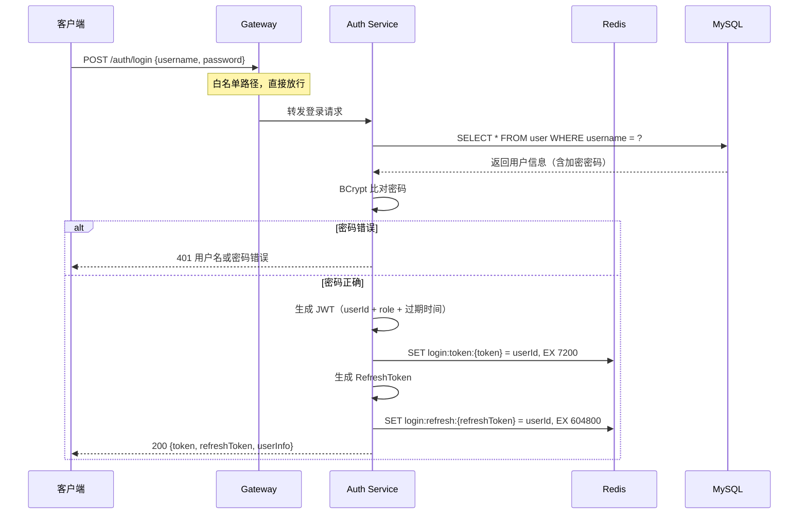
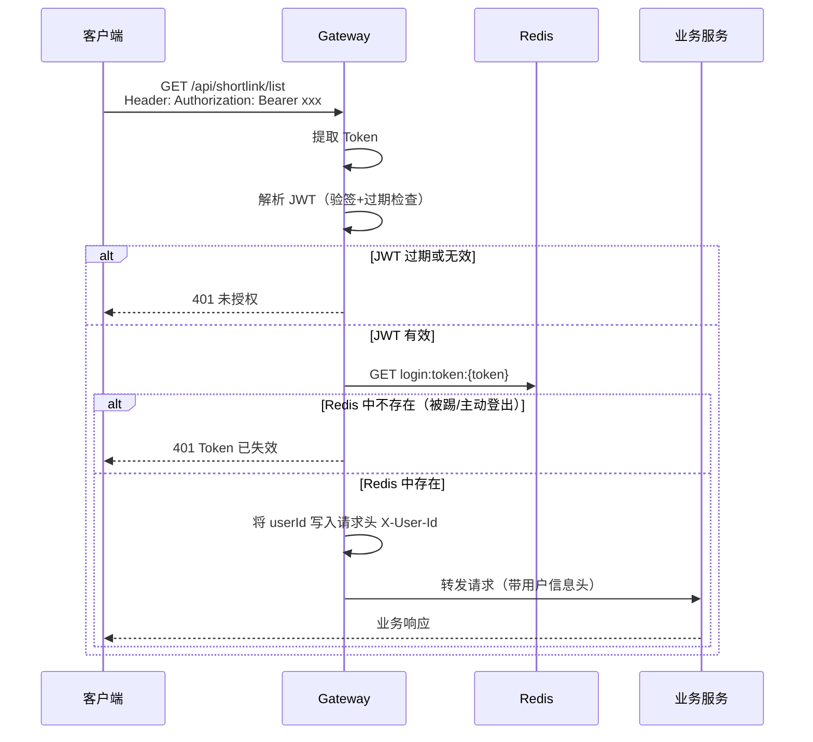
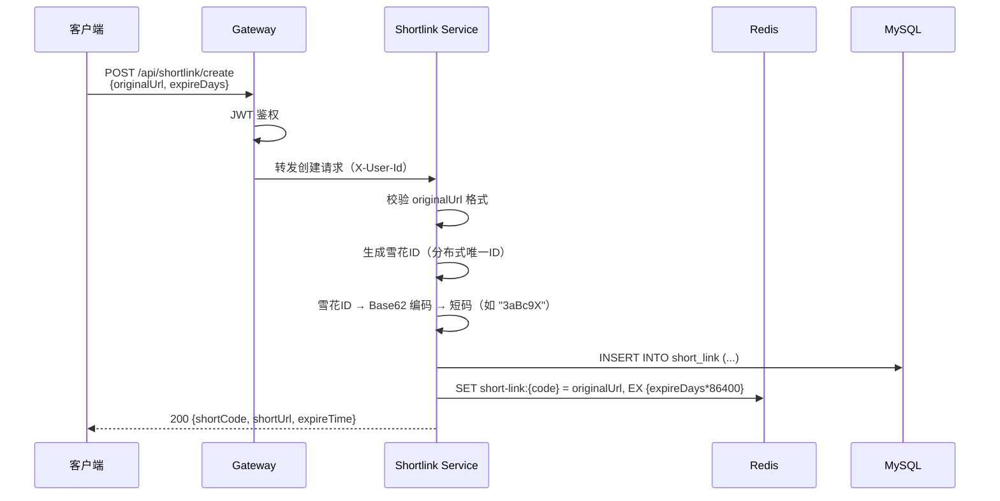
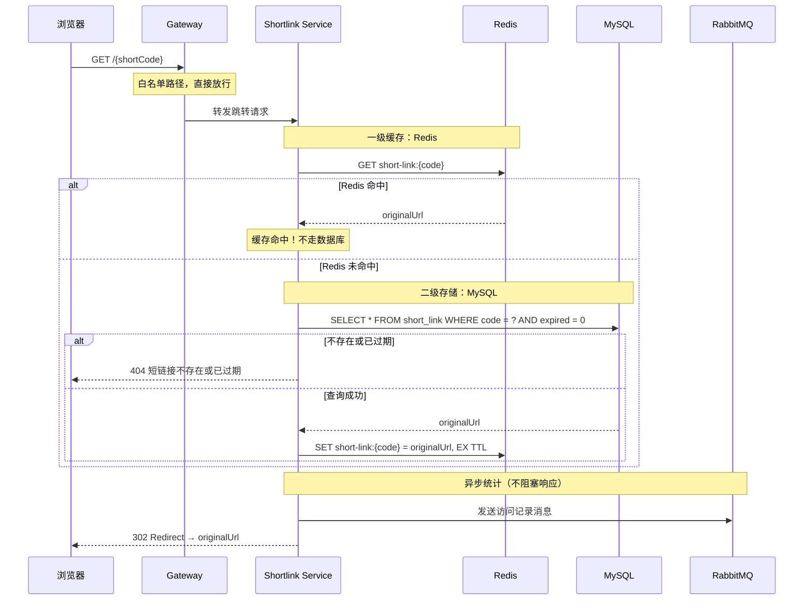
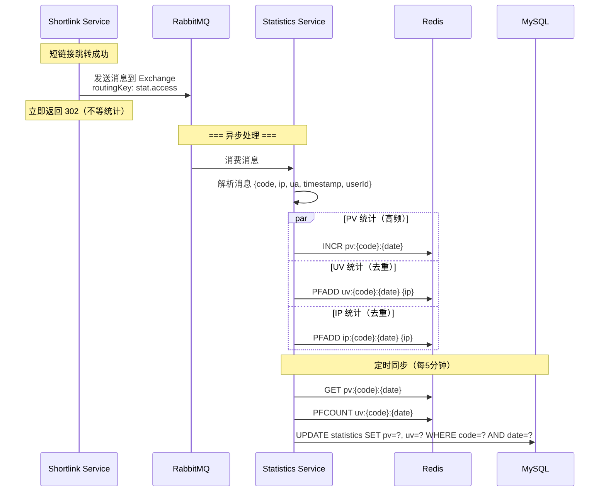
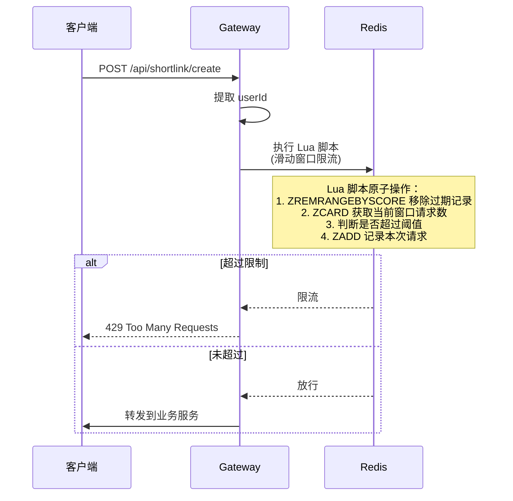
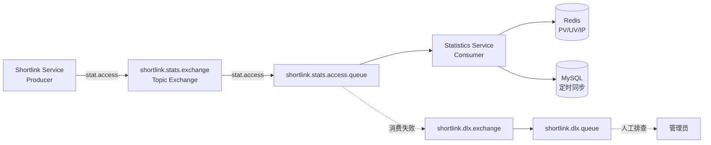

# 企业级短链接系统 - 整体架构设计

> 技术栈：Java 17 + Spring Boot + Spring Cloud Gateway + Spring Security + JWT + Redis + RabbitMQ + MySQL + MyBatis Plus

---

## 一、项目整体架构

### 1.1 为什么需要微服务拆分？

你可能会问：一个短链接系统，真的需要拆成这么多服务吗？

**答案：从学习角度，非常需要。**

一个真实的短链接系统，单机部署完全可以支撑百万级用户。但我们拆分模块的真正目的是：

| 目的 | 说明 |
|------|------|
| **学习服务边界** | 理解什么代码该放哪，是架构师的核心能力 |
| **理解解耦的价值** | 统计挂了不影响跳转，这就是解耦的意义 |
| **学习中间件的正确用法** | Redis/MQ/Gateway 各自解决什么问题 |
| **为复杂项目打基础** | 掌握了这个拆分逻辑，更大项目也能应对 |

### 1.2 模块划分



### 1.3 各模块职责

#### gateway-service（网关服务）
| 职责 | 说明 |
|------|------|
| 统一入口 | 所有外部请求先到网关 |
| JWT 鉴权 | 解析 Token，判断是否放行 |
| 接口限流 | 基于 Redis + Lua 的令牌桶/滑动窗口限流 |
| 路由转发 | 根据路径前缀转发到对应微服务 |
| 白名单管理 | `/auth/login`、`/auth/register`、`/{code}` 无需鉴权 |

**为什么网关独立？**
- 鉴权逻辑集中一处，业务服务不用重复写
- 限流在入口做，恶意请求在最外层就被拦住
- 业务服务可以专心写业务，职责单一

#### auth-service（认证服务）
| 职责 | 说明 |
|------|------|
| 用户注册 | 手机号/邮箱 + 密码注册 |
| 用户登录 | 验证密码，签发 JWT |
| Token 刷新 | 短 Token + 长 RefreshToken 机制 |
| 用户信息管理 | 查询/修改用户基本信息 |

#### shortlink-service（短链接服务）⭐核心
| 职责 | 说明 |
|------|------|
| 短链接生成 | 接收长 URL → 生成短码 |
| 短链接跳转 | 根据短码查原始URL → 302重定向 |
| 有效期管理 | 过期短链自动失效 |
| 发送统计消息 | 跳转成功后发 MQ 消息给统计服务 |

#### statistics-service（统计服务）
| 职责 | 说明 |
|------|------|
| 消费 MQ 消息 | 从 RabbitMQ 拉取访问记录 |
| UV/PV/IP 统计 | 按短链+日期维度聚合 |
| 统计数据查询 | 为后台提供统计接口 |
| 定时任务 | 每日/每周生成统计报表 |

**为什么统计独立？**
- 统计是"非核心链路"，即使统计服务挂了，跳转不能受影响
- 统计写入量大，独立部署方便扩缩容
- 技术选型可以不同（比如统计用 ClickHouse）

#### common-module（公共模块）
| 职责 | 说明 |
|------|------|
| 统一返回体 | `Result<T>` 封装 |
| 全局异常处理 | `GlobalExceptionHandler` |
| 工具类 | 雪花ID、短码生成、URL校验 |
| 通用注解 | 限流注解、日志注解 |
| DTO/枚举 | 跨模块共享的数据对象 |

**为什么抽离公共模块？**
- 避免代码重复（DRY 原则）
- 统一规范（所有服务返回格式一致）
- 修改一处，所有服务生效

---

## 二、核心流程设计

### 2.1 用户登录流程



**设计要点：**
- JWT 存在 Redis 中，支持主动踢人（删除 Redis Key 即可）
- 短 Token（2小时）+ 长 RefreshToken（7天）避免频繁登录
- 密码用 BCrypt，永不明文存储

### 2.2 JWT 鉴权流程



**设计要点：**
- JWT 双重校验：先验签名，再查 Redis，确保"签发过的 Token 可能被撤销"
- 网关只做鉴权，不关心业务
- 用户信息通过 Header 透传，下游服务无需重复解析

### 2.3 短链接生成流程



**为什么用雪花ID + Base62？**

| 方案 | 优点 | 缺点 |
|------|------|------|
| MD5 截取 | 简单 | 碰撞率高，短码不可控 |
| 自增ID + Base62 | 短码有序 | 暴露ID规律，容易被遍历 |
| **雪花ID + Base62** ✅ | 全局唯一、分布式友好、不可预测 | 实现稍复杂 |

**Base62 字符集：** `0-9a-zA-Z`（62个字符，比Base64少了 `+` 和 `/`，更适合URL）

### 2.4 短链接跳转流程（含缓存）⭐核心



**核心设计思想：读多写少 → 缓存为王**
- 短链接一旦创建，几乎不会被修改
- 99% 的请求是跳转（读操作）
- Redis 命中时响应时间 < 5ms
- 统计异步发送，不影响跳转响应速度

### 2.5 Redis 缓存策略详解

```
┌──────────────────────────────────────────┐
│              请求到达                      │
└─────────────────┬────────────────────────┘
                  ▼
         ┌───────────────┐
         │ Redis 查询     │
         └───────┬───────┘
                 │
        ┌────────┴────────┐
        ▼                 ▼
    命中(Hit)         未命中(Miss)
        │                 │
        ▼                 ▼
   直接返回          MySQL 查询
        │                 │
        │            ┌────┴────┐
        │            ▼         ▼
        │        查到数据    没查到
        │            │         │
        │            ▼         ▼
        │     写入 Redis   返回 404
        │     设置 TTL
        │            │
        └────────────┘
             ▼
         302 跳转
```

**缓存策略选择：Cache-Aside（旁路缓存）**
- 读：先查缓存，miss 则查 DB 并回填
- 写：先写 DB，再更新/删除缓存
- 这是最经典、最安全的缓存模式

### 2.6 异步统计流程（RabbitMQ）



**为什么统计要异步？**

| 对比 | 同步统计 | 异步统计（MQ）✅ |
|------|---------|-----------------|
| 跳转响应时间 | 慢（等DB写入） | 快（发消息就行） |
| 统计服务挂了 | 跳转也挂了 💀 | 跳转正常，消息堆积等恢复 |
| 写入峰值 | DB 直接扛 | MQ 削峰填谷 |
| 扩展性 | 差 | 统计服务独立扩容 |

### 2.7 UV / PV / IP 统计详解

```
短链跳转完成
     │
     ▼
  MQ 消息
     │
     ▼
┌─────────────────────────────────────┐
│        Statistics Service 消费       │
├─────────────────────────────────────┤
│                                     │
│  PV（页面浏览量）                     │
│  ─────────────                       │
│  Redis: INCR pv:3aBc9X:2026-05-15   │
│  → 每次访问 +1，最简单粗暴             │
│                                     │
│  UV（独立访客）                       │
│  ─────────────                       │
│  Redis: PFADD uv:3aBc9X:2026-05-15   │
│  → HyperLogLog，误差 0.81%             │
│  → 内存占用极小（一个Key 12KB）        │
│                                     │
│  IP（独立IP）                         │
│  ─────────────                       │
│  Redis: PFADD ip:3aBc9X:2026-05-15   │
│  → 同样用 HyperLogLog                │
│                                     │
└─────────────────────────────────────┘
     │
     │ 每 5 分钟定时任务
     ▼
┌─────────────────────────────────────┐
│         MySQL 持久化                  │
│  UPDATE statistics                   │
│  SET pv = pv + ?, uv = ?, ip = ?    │
│  WHERE code=? AND date=?            │
└─────────────────────────────────────┘
```

**为什么 UV 用 HyperLogLog 而不是 Set？**

| 方案 | 百万UV内存占用 | 精确度 |
|------|-------------|--------|
| Redis Set | ~50MB | 100% |
| **HyperLogLog** ✅ | **12KB** | 99.19% |

12KB vs 50MB，差距 4000 倍。对于统计场景，0.81% 的误差完全可以接受。

### 2.8 限流流程



**限流维度设计：**

| 接口 | 限流维度 | 阈值示例 | 目的 |
|------|---------|---------|------|
| `/auth/login` | IP | 10次/分钟 | 防暴力破解 |
| `/api/shortlink/create` | userId | 100次/分钟 | 防恶意刷短链 |
| `/{code}` 跳转 | IP | 1000次/分钟 | 防止 CC 攻击 |
| 全局 | IP | 5000次/分钟 | 总闸保护 |

**为什么用 Lua 脚本？**
- 多条 Redis 命令需要原子执行
- Lua 脚本在 Redis 服务端执行，无网络往返
- 保证"判断+记录"的原子性

---

## 三、数据库设计

### 3.1 设计原则

1. **索引先行**：根据查询场景反推索引，不是"先建表后补索引"
2. **冷热分离**：高频字段和低频字段分开考虑
3. **反范式适度**：短链接场景读远大于写，允许少量冗余提升查询速度
4. **字段非空**：能用 NOT NULL 就不用 NULL，NULL 会让索引失效

### 3.2 用户表（user）

```sql
CREATE TABLE `user` (
    `id`            BIGINT       NOT NULL COMMENT '用户ID（雪花ID）',
    `username`      VARCHAR(50)  NOT NULL COMMENT '用户名（登录用）',
    `password`      VARCHAR(200) NOT NULL COMMENT '加密密码（BCrypt）',
    `email`         VARCHAR(100)          COMMENT '邮箱',
    `phone`         VARCHAR(20)           COMMENT '手机号',
    `avatar`        VARCHAR(500)          COMMENT '头像URL',
    `role`          VARCHAR(20)  NOT NULL DEFAULT 'USER' COMMENT '角色：USER/ADMIN',
    `status`        TINYINT      NOT NULL DEFAULT 1 COMMENT '状态：1正常 0禁用',
    `last_login_time` DATETIME            COMMENT '最后登录时间',
    `create_time`   DATETIME     NOT NULL DEFAULT CURRENT_TIMESTAMP COMMENT '创建时间',
    `update_time`   DATETIME     NOT NULL DEFAULT CURRENT_TIMESTAMP ON UPDATE CURRENT_TIMESTAMP COMMENT '更新时间',
    `deleted`       TINYINT      NOT NULL DEFAULT 0 COMMENT '逻辑删除：0未删除 1已删除',
    PRIMARY KEY (`id`),
    UNIQUE KEY `uk_username` (`username`),
    UNIQUE KEY `uk_email` (`email`),
    KEY `idx_create_time` (`create_time`)
) ENGINE=InnoDB DEFAULT CHARSET=utf8mb4 COMMENT='用户表';
```

**字段说明：**

| 字段 | 为什么这样设计 |
|------|--------------|
| `id` BIGINT | 雪花ID，全局唯一，分布式不用愁 |
| `password` VARCHAR(200) | BCrypt 加密结果固定 60 字符，200 留足空间 |
| `role` 默认 USER | 注册即普通用户，手动升级管理员 |
| `status` | 支持账号禁用（而非删除） |
| `deleted` | 逻辑删除，数据不真删，出事可追溯 |

**高频查询：**
- `WHERE username = ?`（登录）→ `uk_username` 唯一索引
- `WHERE id = ?`（查用户信息）→ 主键索引

### 3.3 短链接表（short_link）⭐核心

```sql
CREATE TABLE `short_link` (
    `id`            BIGINT        NOT NULL COMMENT '主键ID（雪花ID）',
    `code`          VARCHAR(10)   NOT NULL COMMENT '短码（Base62编码）',
    `original_url`  VARCHAR(2048) NOT NULL COMMENT '原始长链接',
    `title`         VARCHAR(200)           COMMENT '短链接标题（可选）',
    `user_id`       BIGINT        NOT NULL COMMENT '创建用户ID',
    `click_count`   BIGINT        NOT NULL DEFAULT 0 COMMENT '点击次数（冗余字段，非实时）',
    `expire_time`   DATETIME               COMMENT '过期时间（NULL表示永久有效）',
    `status`        TINYINT       NOT NULL DEFAULT 1 COMMENT '状态：1启用 0禁用',
    `create_time`   DATETIME      NOT NULL DEFAULT CURRENT_TIMESTAMP COMMENT '创建时间',
    `update_time`   DATETIME      NOT NULL DEFAULT CURRENT_TIMESTAMP ON UPDATE CURRENT_TIMESTAMP COMMENT '更新时间',
    `deleted`       TINYINT       NOT NULL DEFAULT 0 COMMENT '逻辑删除',
    PRIMARY KEY (`id`),
    UNIQUE KEY `uk_code` (`code`),
    KEY `idx_user_id` (`user_id`),
    KEY `idx_create_time` (`create_time`),
    KEY `idx_expire_time` (`expire_time`)
) ENGINE=InnoDB DEFAULT CHARSET=utf8mb4 COMMENT='短链接表';
```

**字段说明（重点）：**

| 字段 | 为什么这样设计 |
|------|--------------|
| `code` VARCHAR(10) | 6位Base62 = 560亿组合，够用。10位留扩展空间 |
| `original_url` VARCHAR(2048) | 浏览器URL最大长度约2048，够覆盖所有场景 |
| `click_count` | 冗余字段，定时从统计表同步（非实时准确，但查询快） |
| `expire_time` NULL | NULL = 永久有效，简化判断逻辑 |
| `status` | 支持管理员手动下架恶意短链 |

**索引设计依据：**

| 索引 | 对应查询 | 频率 |
|------|---------|------|
| `uk_code` | `WHERE code = ?` 跳转查询 | 🔥🔥🔥🔥🔥 最高频 |
| `idx_user_id` | `WHERE user_id = ?` 我的短链列表 | 🔥🔥🔥 高频 |
| `idx_expire_time` | 定时任务扫描过期短链 | 🔥🔥 中频 |

**为什么 `code` 不用自增 ID？**
- 自增ID暴露业务量（竞品看你的短码长度就知道你做了多少）
- 雪花ID不可预测，防止遍历攻击
- Base62 编码后短码无序，更安全

### 3.4 访问统计表（access_stats）

```sql
CREATE TABLE `access_stats` (
    `id`            BIGINT   NOT NULL COMMENT '主键ID',
    `code`          VARCHAR(10) NOT NULL COMMENT '短码',
    `stat_date`     DATE     NOT NULL COMMENT '统计日期',
    `pv`            BIGINT   NOT NULL DEFAULT 0 COMMENT '页面浏览量（Page View）',
    `uv`            BIGINT   NOT NULL DEFAULT 0 COMMENT '独立访客数（Unique Visitor）',
    `ip_count`      BIGINT   NOT NULL DEFAULT 0 COMMENT '独立IP数',
    `create_time`   DATETIME NOT NULL DEFAULT CURRENT_TIMESTAMP COMMENT '创建时间',
    `update_time`   DATETIME NOT NULL DEFAULT CURRENT_TIMESTAMP ON UPDATE CURRENT_TIMESTAMP COMMENT '更新时间',
    PRIMARY KEY (`id`),
    UNIQUE KEY `uk_code_date` (`code`, `stat_date`),
    KEY `idx_stat_date` (`stat_date`)
) ENGINE=InnoDB DEFAULT CHARSET=utf8mb4 COMMENT='访问统计表';
```

**为什么这样设计：**

| 设计选择 | 原因 |
|---------|------|
| 按天聚合 | 一条记录 = 一个短链的一天，避免单日数据爆炸 |
| `uk_code_date` 联合唯一键 | 一个短链一天只有一行，UPSERT 更新 |
| PV/UV/IP 三个字段分开 | 不同指标独立查看，不混在一起 |
| PV 不用单独表 | 按天聚合后数据量可控，不需要分表 |

**高频查询：**
- `WHERE code = ? AND stat_date BETWEEN ? AND ?`（某短链的7天趋势）
- `WHERE stat_date = ? ORDER BY pv DESC LIMIT 10`（今日热门）

---

## 四、Redis 设计

### 4.1 Key 命名规范

```
{业务域}:{数据类型}:{标识符}
```

统一用冒号分隔，层次清晰，方便监控和清理。

### 4.2 完整 Key 设计表

| 功能 | Key 格式 | 示例 | 类型 | 过期时间 | 说明 |
|------|---------|------|------|---------|------|
| **用户Token** | `login:token:{token}` | `login:token:eyJhbG...` | String | 2小时 | 存 userId，支持主动踢人 |
| **用户RefreshToken** | `login:refresh:{refreshToken}` | `login:refresh:a1b2c3...` | String | 7天 | 用于刷新短Token |
| **短链缓存** | `short-link:{code}` | `short-link:3aBc9X` | String | = expireDays | 跳转核心缓存，命中率 99%+ |
| **PV 统计** | `pv:{code}:{date}` | `pv:3aBc9X:2026-05-15` | String(INCR) | 35天 | 每次访问 +1 |
| **UV 统计** | `uv:{code}:{date}` | `uv:3aBc9X:2026-05-15` | HyperLogLog | 35天 | PFADD + PFCOUNT |
| **IP 统计** | `ip:{code}:{date}` | `ip:3aBc9X:2026-05-15` | HyperLogLog | 35天 | 独立IP去重 |
| **限流-登录** | `limit:login:{ip}` | `limit:login:192.168.1.1` | ZSet | 60s | 滑动窗口 |
| **限流-创建** | `limit:create:{userId}` | `limit:create:123456` | ZSet | 60s | 滑动窗口 |
| **限流-跳转** | `limit:redirect:{ip}` | `limit:redirect:192.168.1.1` | ZSet | 60s | 滑动窗口 |
| **布隆过滤器** | `bloom:short-code` | `bloom:short-code` | Bloom | 永久 | 快速判断短码是否存在 |

### 4.3 布隆过滤器（Bloom Filter）

```
请求: GET /aBcDeF
         │
         ▼
   布隆过滤器判断
   ┌─────────────┐
   │ aBcDeF 存在? │
   └──────┬──────┘
          │
    ┌─────┴─────┐
    ▼           ▼
  存在         不存在
    │           │
    ▼           ▼
  查 Redis   直接返回 404
  (小概率误判)  (100%准确)
```

**为什么用布隆过滤器？**
- 绝大多数短链请求是不存在的（恶意扫描、拼写错误）
- 布隆过滤器用极小内存（百万短码 ≈ 1MB）过滤掉 99.9% 的无效请求
- 避免无效请求穿透 Redis 打到 MySQL
- 误判率可配置（这里设 0.1%），误判也只是多查一次 Redis，无伤大雅

### 4.4 缓存更新策略（短链生成/修改时）

```
创建短链：
  MySQL INSERT → Redis SET（写入缓存）→ Bloom ADD

修改短链：
  MySQL UPDATE → Redis DEL（删除缓存，等下次访问回填）

删除短链：
  MySQL UPDATE deleted=1 → Redis DEL

过期短链：
  定时任务扫 expire_time < NOW() → MySQL UPDATE status=0 → Redis DEL
```

### 4.5 内存估算

| 项目 | 计算 | 结果 |
|------|------|------|
| 100万短链缓存 | 100万 × (10B key + 150B value avg) | ~160MB |
| 100万短链布隆 | Bloom Filter 100万@0.1% | ~1.2MB |
| 1000条/天的PV | 1000天 × 1KB | ~1MB/天 |
| **总计** | | **< 200MB** |

一台 2GB Redis 实例就能轻松支撑百万级短链服务。

---

## 五、RabbitMQ 设计

### 5.1 为什么统计要异步？（再强调）

```
同步模式（❌）：
  跳转 → 写MySQL统计 → 返回302
  用户等数据库IO，体验差

异步模式（✅）：
  跳转 → 发MQ消息 → 立即返回302
          └→ 消费者慢慢写Redis/MySQL
  用户无感知，响应快
```

### 5.2 MQ 组件设计

| 组件 | 名称 | 说明 |
|------|------|------|
| **Exchange** | `shortlink.stats.exchange` | Topic 类型，支持灵活路由 |
| **Queue** | `shortlink.stats.access.queue` | 访问统计消费队列 |
| **RoutingKey** | `stat.access` | 访问事件路由键 |
| **Dead Letter Exchange** | `shortlink.dlx.exchange` | 死信交换机（消费失败重试） |
| **Dead Letter Queue** | `shortlink.dlx.queue` | 死信队列（人工排查） |

### 5.3 消息结构

```json
{
  "code": "3aBc9X",
  "originalUrl": "https://example.com/very/long/url",
  "ip": "192.168.1.100",
  "userAgent": "Mozilla/5.0 ...",
  "referer": "https://twitter.com",
  "userId": null,
  "timestamp": 1715769600000
}
```

### 5.4 消息流转



### 5.5 消费者职责

1. **实时统计写入 Redis**：PV INCR、UV/IP PFADD
2. **定时同步 MySQL**：每 5 分钟将 Redis 数据批量写入 MySQL
3. **异常处理**：消费失败 3 次后进入死信队列

**为什么不是每条消息都写 MySQL？**
- 高并发下 MySQL 写入是瓶颈
- Redis 扛住写入压力，批量同步到 MySQL
- 万一 Redis 挂了，MQ 消息还在，可以重放

### 5.6 配置参数

```yaml
# 消费者并发数
concurrency: 5-10
# 手动确认
acknowledge-mode: manual
# 预取数量（每次拉几条）
prefetch: 50
```

---

## 六、项目目录结构

### 6.1 Maven 多模块总览

```
shortlink/
├── pom.xml                          # 父 POM（依赖版本管理）
├── docs/                            # 项目文档
│   └── ARCHITECTURE.md              # 本架构设计文档
├── shortlink-common/                # 公共模块
├── shortlink-gateway/               # 网关服务
├── shortlink-auth/                  # 认证服务
├── shortlink-service/               # 短链接服务（核心）
├── shortlink-statistics/            # 统计服务
└── shortlink-admin/                 # 后台管理服务
```

### 6.2 父 POM 职责

```xml
<!-- pom.xml 核心作用 -->
<dependencyManagement>
    <!-- 统一管理所有依赖版本号 -->
    <!-- Spring Boot: 3.2.x -->
    <!-- Spring Cloud: 2023.0.x -->
    <!-- MyBatis Plus: 3.5.x -->
</dependencyManagement>
```

### 6.3 各模块详细结构

#### shortlink-common（公共模块）

```
shortlink-common/
├── pom.xml
└── src/main/java/com/shortlink/common/
    ├── result/
    │   ├── Result.java              # 统一返回体 {code, msg, data}
    │   └── ResultCode.java          # 状态码枚举
    ├── exception/
    │   ├── BusinessException.java   # 业务异常
    │   └── GlobalExceptionHandler.java  # 全局异常处理
    ├── utils/
    │   ├── SnowflakeIdGenerator.java  # 雪花ID生成器
    │   ├── Base62Encoder.java         # Base62编码/解码
    │   ├── UrlValidator.java          # URL格式校验
    │   └── JwtUtil.java               # JWT生成/解析工具
    ├── annotation/
    │   └── RateLimit.java           # 限流注解
    ├── dto/
    │   ├── LoginDTO.java            # 登录请求体
    │   ├── RegisterDTO.java         # 注册请求体
    │   └── ShortLinkCreateDTO.java  # 创建短链请求体
    └── enums/
        ├── UserRoleEnum.java        # 角色枚举
        └── ShortLinkStatusEnum.java # 短链状态枚举
```

**common 模块放什么？**
- ✅ 放：DTO、工具类、枚举、统一返回体、注解、异常定义
- ❌ 不放：数据库实体（Entity）、Service、Controller、配置

#### shortlink-gateway（网关服务）

```
shortlink-gateway/
├── pom.xml
└── src/main/java/com/shortlink/gateway/
    ├── GatewayApplication.java
    ├── config/
    │   ├── RouteConfig.java         # 路由规则配置
    │   └── CorsConfig.java          # 跨域配置
    ├── filter/
    │   ├── AuthGlobalFilter.java    # 全局鉴权过滤器
    │   └── RateLimitFilter.java     # 限流过滤器
    └── util/
        └── GatewayJwtUtil.java      # 网关专用 JWT 工具
```

#### shortlink-auth（认证服务）

```
shortlink-auth/
├── pom.xml
└── src/main/java/com/shortlink/auth/
    ├── AuthApplication.java
    ├── controller/
    │   └── AuthController.java      # /auth/login, /auth/register
    ├── service/
    │   ├── AuthService.java
    │   └── impl/
    │       └── AuthServiceImpl.java
    ├── mapper/
    │   └── UserMapper.java          # MyBatis Plus BaseMapper
    └── entity/
        └── User.java                # 用户实体
```

#### shortlink-service（短链接服务）⭐核心

```
shortlink-service/
├── pom.xml
└── src/main/java/com/shortlink/service/
    ├── ShortlinkApplication.java
    ├── controller/
    │   └── ShortLinkController.java # CRUD + 跳转
    ├── service/
    │   ├── ShortLinkService.java
    │   └── impl/
    │       └── ShortLinkServiceImpl.java
    ├── mapper/
    │   └── ShortLinkMapper.java
    ├── entity/
    │   └── ShortLink.java
    ├── mq/
    │   └── StatsMessageProducer.java  # MQ 生产者
    └── config/
        ├── RedisConfig.java
        ├── RabbitMQConfig.java
        └── BloomFilterConfig.java
```

#### shortlink-statistics（统计服务）

```
shortlink-statistics/
├── pom.xml
└── src/main/java/com/shortlink/statistics/
    ├── StatisticsApplication.java
    ├── controller/
    │   └── StatsController.java       # 统计查询接口
    ├── service/
    │   ├── StatsService.java
    │   └── impl/
    │       └── StatsServiceImpl.java
    ├── mapper/
    │   └── AccessStatsMapper.java
    ├── entity/
    │   └── AccessStats.java
    ├── mq/
    │   └── StatsMessageConsumer.java  # MQ 消费者
    └── task/
        └── StatsSyncTask.java         # 定时同步 Redis→MySQL
```

#### shortlink-admin（后台管理）

```
shortlink-admin/
├── pom.xml
└── src/main/java/com/shortlink/admin/
    ├── AdminApplication.java
    ├── controller/
    │   ├── AdminUserController.java   # 用户管理
    │   └── AdminShortLinkController.java  # 短链管理
    ├── service/
    │   └── ...
    └── mapper/
        └── ...（复用 shortlink-service 的 Mapper 或用 Feign 调用）
```

### 6.4 分层说明

```
请求流 → Controller → Service → Mapper → DB
                ↓           ↓
              DTO/VO      Entity
              
Controller 层：
  - 接收请求参数，参数校验（@Valid）
  - 调用 Service
  - 返回 Result<T>
  - 不做业务逻辑

Service 层：
  - 业务逻辑核心
  - 事务管理（@Transactional）
  - 调用 Mapper + Redis + MQ
  - 接口 + 实现分离（方便单元测试）

Mapper 层：
  - MyBatis Plus BaseMapper
  - 只做数据库操作
  - 复杂查询用 XML 或 @Select
```

---

## 七、推荐开发顺序

> 按"从简单到复杂、从核心到周边"的路线，每一步都能独立运行和验证。

### 第一阶段：基础设施搭建（第1-2天）

| 步骤 | 内容 | 学习目标 |
|------|------|---------|
| 1.1 | 创建 Maven 多模块项目 | Maven 父子 POM、模块依赖 |
| 1.2 | 搭建 common 模块 | Result、全局异常、雪花ID |
| 1.3 | Docker 安装 MySQL + Redis + RabbitMQ | 中间件基础 |
| 1.4 | 各模块连上数据库 | 数据源配置、连接池 |

### 第二阶段：认证 + JWT（第3-4天）

| 步骤 | 内容 | 学习目标 |
|------|------|---------|
| 2.1 | Auth Service：注册 + 登录 | MyBatis Plus CRUD、BCrypt |
| 2.2 | JWT 签发 + Redis 存储 | JWT 原理、Redis 基础操作 |
| 2.3 | Gateway：JWT 鉴权过滤器 | Spring Cloud Gateway 过滤链 |
| 2.4 | Token 刷新接口 | RefreshToken 机制 |

**这一步完成就能用 Postman 测通：注册→登录→拿Token→鉴权访问。**

### 第三阶段：短链接核心（第5-7天）⭐重点

| 步骤 | 内容 | 学习目标 |
|------|------|---------|
| 3.1 | 雪花ID + Base62 短码生成 | 分布式ID、编码算法 |
| 3.2 | 创建短链接接口 | CRUD 完整流程 |
| 3.3 | 短链接跳转接口 | 302重定向、URL解析 |
| 3.4 | Redis 缓存短链 | Cache-Aside 模式 |
| 3.5 | 布隆过滤器 | 预防缓存穿透 |

**这一步做完，核心功能就跑通了：创建短链→跳转→缓存。**

### 第四阶段：统计系统（第8-10天）

| 步骤 | 内容 | 学习目标 |
|------|------|---------|
| 4.1 | RabbitMQ 生产者（发消息） | MQ 基础、消息确认 |
| 4.2 | RabbitMQ 消费者（收消息） | 手动ACK、并发消费 |
| 4.3 | Redis PV/UV/IP 统计 | HyperLogLog、INCR |
| 4.4 | 定时同步 MySQL | @Scheduled、批量写入 |
| 4.5 | 统计查询接口 | 按天/周/月趋势查询 |

**这一步学完，你就能说"我用过 RabbitMQ 解耦统计"。**

### 第五阶段：高级特性（第11-14天）

| 步骤 | 内容 | 学习目标 |
|------|------|---------|
| 5.1 | Gateway 限流（Redis Lua滑动窗口） | Lua脚本、原子操作 |
| 5.2 | 短链接有效期（定时任务扫描过期） | @Scheduled、批量处理 |
| 5.3 | 死信队列（消费失败重试） | MQ 高级特性 |
| 5.4 | Swagger 接口文档 | 自动生成 API 文档 |

### 第六阶段：后台管理 + 收尾（第15-17天）

| 步骤 | 内容 | 学习目标 |
|------|------|---------|
| 6.1 | Admin 后台：用户管理 | 管理员权限验证 |
| 6.2 | Admin 后台：短链管理 | 下架、数据看板 |
| 6.3 | 全局异常处理 + 日志 | AOP、MDC日志追踪 |
| 6.4 | 单元测试 + 接口测试 | JUnit5、MockMvc |

### 学习路线图

```
第一阶段                第二阶段              第三阶段 ⭐
┌──────────┐         ┌──────────┐         ┌──────────────┐
│ Maven多模块│ ──────→ │ JWT鉴权   │ ──────→ │ 短链接CRUD    │
│ 项目骨架  │         │ 用户认证   │         │ 缓存策略      │
└──────────┘         └──────────┘         └──────┬───────┘
                                                  │
                    第六阶段              第四阶段  │
                  ┌──────────┐         ┌──────────┴───┐
                  │ 后台管理   │ ←────── │ MQ异步统计    │
                  │ 收尾测试   │         │ UV/PV/IP     │
                  └──────────┘         └──────┬───────┘
                                               │
                                         第五阶段
                                       ┌──────────┐
                                       │ 限流       │
                                       │ 死信队列    │
                                       │ Swagger   │
                                       └──────────┘
```

---

## 八、写给开发者的架构思考

### 这个项目教会你什么？

1. **分层思想**：Controller → Service → Mapper，每层职责清晰
2. **缓存为王**：读多写少的场景，Redis 是性能关键
3. **异步解耦**：非核心链路用 MQ 解耦，保护核心链路
4. **防御式设计**：限流、布隆过滤器、Token 撤销，安全是设计出来的
5. **分布式ID**：雪花ID + Base62，全局唯一 + 不可预测

### 常见的"初学者陷阱"（提前告诉你）

| 陷阱 | 正确做法 |
|------|---------|
| 在 Controller 写业务逻辑 | Controller 只做参数校验和调用 Service |
| 每个请求都操作 Redis 再操作 DB | 读操作优先查缓存 |
| JWT 只解析不查 Redis | 查 Redis 才能支持 Token 撤销 |
| 统计同步阻塞跳转响应 | MQ 异步，跳转和统计完全解耦 |
| 所有异常都用 try-catch | 全局异常处理器统一处理 |

---

> 📌 **下一步**：确认架构设计无误后，我们从"第一阶段：Maven 多模块项目搭建"开始，一步一步写代码。
> 
> 你在任何一步有问题都可以停下来问"为什么"，我会详细解释。
